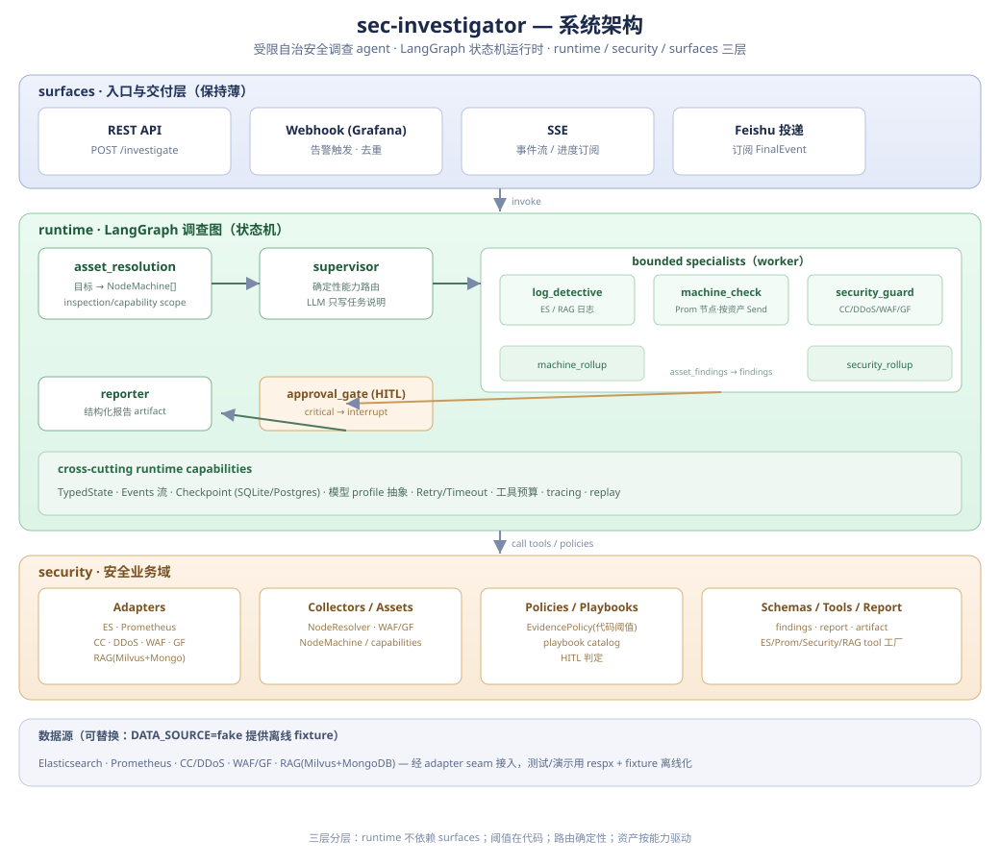

# sec-investigator

受限自治的安全调查 agent：基于 LangGraph 的**统一状态机运行时**，把"告警 → 证据收集 → 风险判定 → 结构化报告"封装成一条确定性、可观测、可回放的调查流水线。

核心主张是**受限自治（constrained autonomy）**：agent 不在无界空间里自由发挥，而是在一个边界明确的图中、在显式的状态契约与代码级策略约束下，只能从许可动作中做选择。

## 架构

三层严格分层（`runtime` 不依赖 `surfaces`），一个全局调查图：

```
START → asset_resolution → supervisor
   ├─→ log_detective
   ├─→ dispatch_machine_checks → Send(machine_check per asset) → machine_rollup
   ├─→ dispatch_security_checks → Send(security_guard per asset) → security_rollup
   ├─→ approval_gate (HITL)
   └─→ reporter → END
```

- **asset_resolution**：把原始目标（IP/域名）解析成带能力的 `NodeMachine[]`（node / product / node_product），生成 `inspection_scope` 与 `capability_scope`。
- **supervisor**：**确定性能力路由**（代码决定去哪个 worker），LLM 只负责写一条任务说明。
- **worker**：`log_detective`（ES/RAG 日志）、`machine_check`（Prom 节点，按资产 `Send` 扇出）、`security_guard`（CC/DDoS/WAF/GF）。
- **rollup**：`asset_findings` 合并回顶层 `findings`。
- **approval_gate**：`EvidencePolicy.requires_approval()` 命中 critical 时 `interrupt()` 触发人工审批。
- **reporter**：用 `REPORT_WRITER` 模型产出结构化 `InvestigationReport` artifact。



## 设计要点

| 关注点 | 做法 |
|---|---|
| 分层 | `runtime` / `security` / `surfaces` 三层；surfaces 保持薄 |
| 路由 | 代码 + 能力驱动，非 LLM 自由决策 |
| 阈值 | 全部在 `EvidencePolicy`（代码），不在 prompt |
| 状态 | `TypedDict` + reducer，显式合并 |
| 模型 | `build_model(profile)` 抽象，无厂商锁定 |
| 数据源 | `DATA_SOURCE=fake/real` 单一 seam（httpx.MockTransport），离线可演示 |
| 连接生命周期 | adapter 懒加载、closure 持有、`aclose()`，无模块级单例 |
| 事件 | `ToolCall/ToolResult/Artifact/Final/Status/ApprovalRequest` 全流 |
| 持久化 | Checkpoint：SQLite（dev）/ Postgres（prod） |

## 快速开始

```bash
uv sync                       # 安装依赖（Python ≥3.12）
cp .env.example .env          # 填写 LLM 密钥
uv run sec-investigator       # 启动 FastAPI（默认 :18230）
uv run pytest -q              # 全量测试（离线、秒级）
```

配置：`src/runtime/config/settings.py`（pydantic-settings，读 `.env`）。

### 离线演示（DATA_SOURCE=fake）

默认 `DATA_SOURCE=fake`：所有数据源（ES / Prometheus / CC / DDoS / WAF / GF / RAG）
由 `src/security/fake/` 提供**合成但真实**的 fixture（源自 `docs/incidents.md` 的 3 条
真实事故），无需企业 VPN 或任何内网系统即可跑通整条调查链。仅需在 `.env` 配置一个
LLM API key 供 agent 推理与写报告：

```bash
uv run python examples/run_demo.py game.ali213.net        # 4xx 爬虫扫描
uv run python examples/run_demo.py api2.xs2027.cn         # 5xx 源站应用故障
uv run python examples/run_demo.py kk331dsdi32onew.liu6t.cn  # 高并发源站过载
```

切到真实数据源：`.env` 里设 `DATA_SOURCE=real`（需内网可达 + 凭据）。

## 目录结构

```
src/
  runtime/     # LangGraph 运行时内核：state / graph / events / checkpoint / llm / approvals / artifacts
  security/    # 安全业务域：adapters / collectors / assets / policies / playbooks / schemas / tools / rag
  surfaces/    # 入口与交付：api / webhook / feishu / sse
tests/
  unit/        # 单元测试（respx 离线 mock）
  replay/      # 3 条真实事故回放
docs/
  architecture.svg / agent_runtime_position.md   # 架构
  incidents.md                                    # 3 条真实告警记录（金标准）
  origin_data/                                    # 各数据源/产品 API 参考
```

## 测试

`uv run pytest -q` → 485 用例，全量离线、约 6 秒。外部数据源一律用 respx/fixture mock，不触真实端点。

## 路线图

见 [todo.md](todo.md)（作品集化改造 M1–M4 + 既有技术待办）。
